# Editor de texto

## Descripción de la aplicación  

* La aplicación consiste en un editor de texto para poder crear notas o fragmentos de código y poder recuperarlos de manera confiable para usarlos más adelante.
* Esta aplicación es una SPA (Single Page Application), cumple con los criterios de PWA y cuenta con una serie de técnicas de persistencia de datos que sirven como redundancia en caso de que el navegador no admita una de las opciones.
* Asimismo, esta aplicación:
    * Funciona sin conexión a Internet.
    * Guarda y recupera el contenido del editor de texto utilizando un almacenamiento de base de datos con IndexedDB:
        * El contenido del editor de texto se guarda automáticamente cada vez que la ventana de DOM está desenfocada, es decir cuando se da algún click fuera de la ventana de DOM.
        * Cuando se abre el editor después de cerrarlo, el contenido es recuperado del almacenamiento con IndexedDB.
    * Puede instalarse, descargando la aplicación web como un ícono en el escritorio del ordenador.
* Esta aplicación está desplegada usando Heroku.
    
## Enlace a la aplicación funcional

* [Enlace a aplicación]()

## Instrucciones de instalación  

* Esta aplicación requiere:

    * En General:
      * Instalación de:
        * Node JS versión 16.18.0
        * Paquete express 4.17.1
        * Paquete if-env 1.0.4
        * Paquete concurrently 5.2.0
        * Paquete nodemon 2.0.4

    * En el lado del Cliente:
      * Instalación de: 
        * Paquete @babel/core 7.15.0
        * Paquete babel/plugin-transform-runtime 7.15.0
        * Paquete @babel/preset-env 7.15.0
        * Paquete @babel/runtime 7.15.3
        * Paquete babel-loader 8.2.2
        * Paquete css-loader 6.2.0
        * Paquete html-webpack-plugin 5.3.2
        * Paquete http-server 0.11.1
        * Paquete style-loader 3.2.1
        * Paquete webpack 5.51.1
        * Paquete webpack-cli 4.8.0
        * Paquete webpack-dev-server 4.0.0
        * Paquete webpack-pwa-manifest 4.3.0
        * Paquete workbox-webpack-plugin 6.2.4
        * Paquete code-mirror-themes 1.0.0
        * Paquete idb 6.1.2

    * En el lado del Servidor:
        * Paquete express 4.17.1
        * Paquete nodemon 2.0.4

## Instrucciones para realizar pruebas 

* La ejecución de la aplicación se tiene que hacer desde la terminal de node.js
* Asegúrate de estar en la ubicación de la carpeta principal/raíz de la aplicación: EDITOR-TEXTO\      
  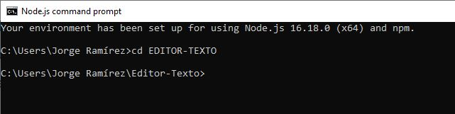
* Para instalar todos los paquetes necesarios tanto para el cliente, como para el servidor, ejecuta el comando "npm run install" desde la terminal de node.js  
  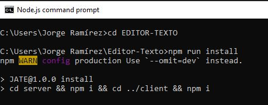
* Para iniciar el servidor, emplea el comando "npm start" desde la terminal de node.js      
  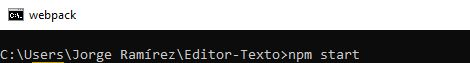
* Una vez que se haya terminado de hacer el proceso de "build", deberás ver un mensaje que te indique que la aplicación está escuchando en el puerto 3000  
  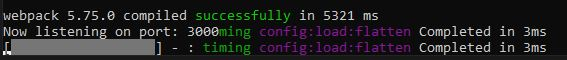
* A partir de este punto puedes emplear la dirección http://localhost:3000/ para acceder a la aplicación desde un navegador.  
  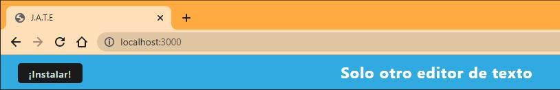

## Información de uso de la aplicación

* Una vez que hayas accedido a la aplicación mediante el link de [Heroku]() o si estás haciendo pruebas locales mediante la dirección http://localhost:3000/:
  * Podrás ver un texto inicial en el editor de texto como se aprecia en la siguiente imagen:  
      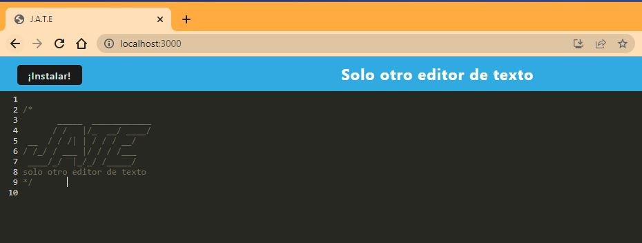 
  * Puedes agregar líneas con los fragmentos de código o notas que desees:  
      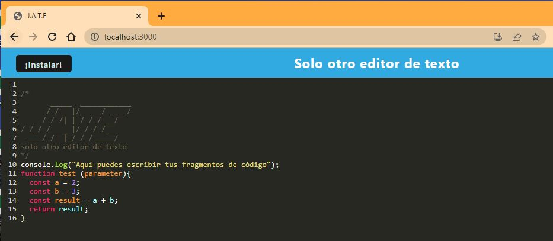 
  * Para que estas notas se guarden solamente tienes que dar un click fuera de la ventana del navegador donde tengas abierta la aplicación.
  * Si por algún motivo cierras la pestaña donde tenías abierta la aplicación o cierras el navegador, cuando vuelvas a entrar a la aplicación verás tus notas y fragmentos de código guardados.
  * Para instalar la aplicación, puedes presionar el botón con la etiqueta "Instalar!" o puedes dar click en el ícono resaltado en rojo que está ubicado en la barra de navegación.  
      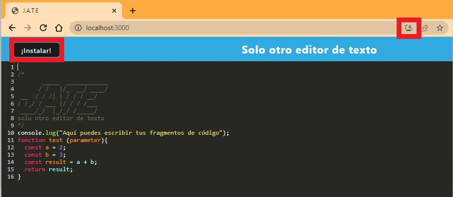 
  * Una vez que lo hayas presionado, te pedirá que confirmes la instalación, a lo cual tienes que acceder:  
       
  * Tras unos segundos, la aplicación ya no se verá en tu navegador, sino que estará en una ventana independiente, lo cual significa que ha sido instalada.  
      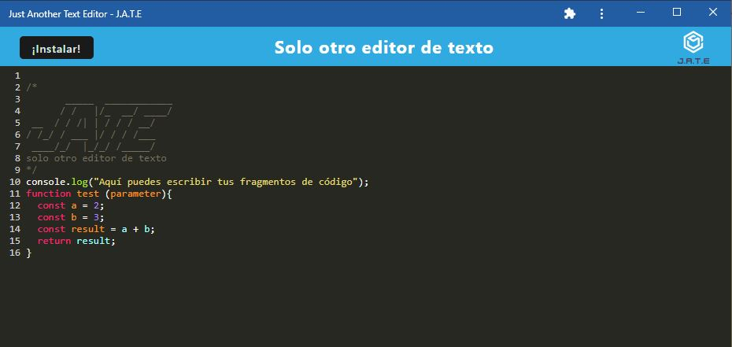
  * También una vez que haya finalizado la instalación, podrás ver el ícono de la aplicación en tu escritorio de la computadora. Desde este ícono puedes acceder directamente a la aplicación.  
      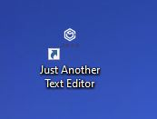
  * Cuando hayas instalado la aplicación:
    * Si estás usando la aplicación desde el navegador, puedes abrirla en tu aplicación instalada haciendo click en el siguiente ícono del navegador:    
        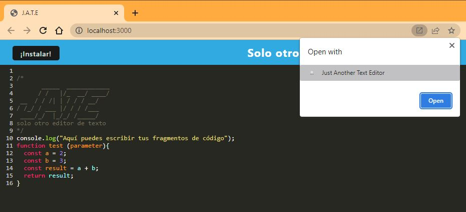
    * Por el contrario, si estás usando la aplicación instalada, puedes abrirla en el navegador haciendo click en el siguiente ícono de la aplicación instalada:    
        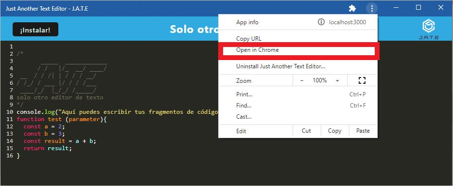
  * Si deseas desinstalar la aplicación, puedes presionar el elemento con tres puntos en la aplicación instalada y seleccionar la opción de "Uninstall Just Another Text Editor..."
      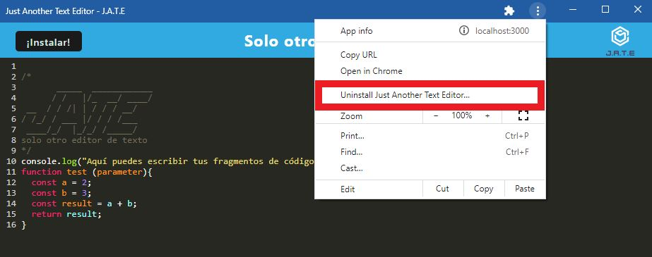
  * Una vez que se haya desinstalado la aplicación, ya no verás el ícono de esta en el escritorio de tu computadora.

## Apariencia de la aplicación

* 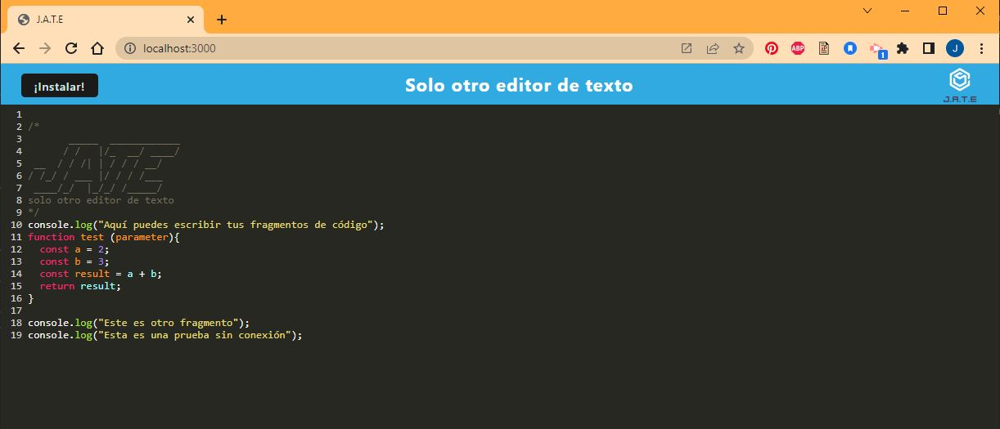
